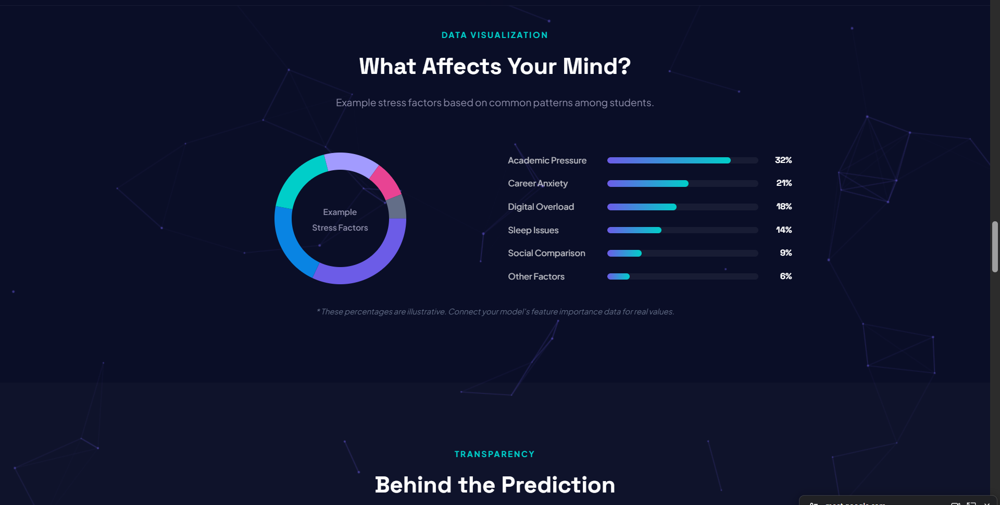
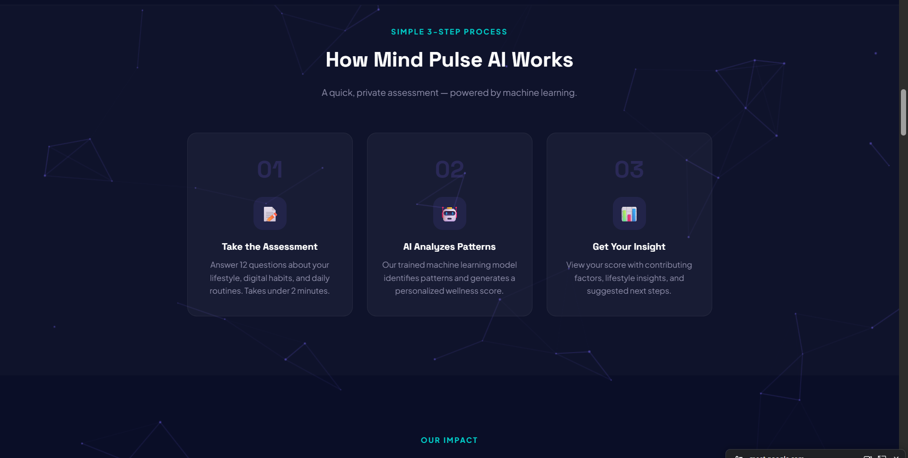
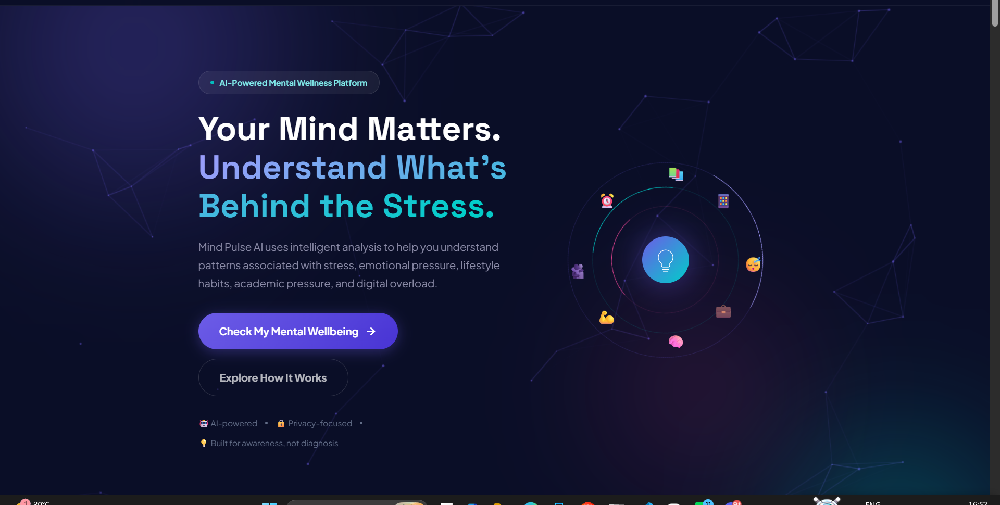

# 🧠 Mind Pulse AI

### A beginner-friendly end-to-end Machine Learning project for mental wellness awareness.

[](https://mental-health-score-2-9jzp.onrender.com/)
[](https://github.com/AmanSheikh7867/Mental-Health-Score)
[](https://www.python.org/)
[](https://fastapi.tiangolo.com/)
[](https://render.com/)

> **Mind Pulse AI is an educational Machine Learning project for awareness and self-reflection. It is not a medical diagnostic system.**

---

## 🌐 Live Project

### 🚀 [Try Mind Pulse AI](https://mental-health-score-2-9jzp.onrender.com/)

Mind Pulse AI is deployed as a complete web application:

- **Frontend:** Render Static Site
- **Backend:** FastAPI Web Service on Render
- **Prediction API:** `POST /predict`

The application takes lifestyle, academic, digital-habit and stress-related inputs and returns a predicted wellness score with visual insights.

---

## 📸 Project Preview

### 🏠 Landing Page



### ⚙️ How It Works



### 📊 Stress Factors & Insights



---

## 🎯 About the Project

**Mind Pulse AI** is one of my first end-to-end Machine Learning projects.

The main goal was to understand how a Machine Learning model moves beyond a Jupyter Notebook and becomes a usable application:

**Dataset → Model → API → Frontend → Deployment**

The project predicts a **mental-health / wellness score on a 0–10 scale** from a set of lifestyle and digital-behaviour features. The result is shown through an interactive interface designed to make the prediction easier to understand.

### Inputs used by the model

- Age
- Gender
- Country
- Academic level
- Most-used social platform
- Purpose of social-media use
- Average daily usage hours
- Daily phone unlocks
- Study hours
- Physical activity hours
- Sleep hours per night
- Self-reported stress level

---

## 🔄 How the Application Works

```text
User fills the assessment
          ↓
JavaScript collects the input
          ↓
JSON request is sent to FastAPI
          ↓
Pydantic validates the data
          ↓
Saved ML pipeline processes the features
          ↓
Random Forest model predicts the score
          ↓
FastAPI returns the prediction
          ↓
Frontend displays the score & insights
```

The saved Joblib model contains the preprocessing pipeline together with the estimator. This allows the backend to send the raw feature values through the same transformations used during model training.

---

## 🤖 Machine Learning

### Dataset

The project uses:

`Student Social Media And Mental Health Impact.csv`

The training notebook contains **5,000 rows and 13 columns** and uses:

`Mental_Health_Score`

as the prediction target.

### Model Development

The notebook covers:

1. Data loading and exploration
2. Feature and target separation
3. Country grouping
4. Train/test split
5. Feature-specific preprocessing
6. `ColumnTransformer`
7. `Pipeline`
8. Linear Regression baseline
9. Random Forest Regression
10. Hyperparameter search
11. Model evaluation
12. Saving the final pipeline with Joblib

### Preprocessing

| Feature type | Processing |
|---|---|
| `Study_Hours` | `log1p` + `StandardScaler` |
| Other numeric features | `StandardScaler` |
| `Stress_Level` | `OrdinalEncoder` |
| Categorical features | `OneHotEncoder(handle_unknown='ignore')` |

---

## 📊 Model Evaluation

The notebook recorded these test-set results:

| Model | Test R² | MAE | RMSE |
|---|---:|---:|---:|
| Linear Regression | 0.7398 | 0.5362 | 0.6760 |
| **Random Forest (default)** | **0.8776** | **0.3472** | **0.4637** |
| Random Forest (tuned) | 0.8650 | 0.3689 | 0.4869 |

### What do these metrics mean?

- **R²:** how much of the variation in the target is explained by the model.
- **MAE:** average absolute prediction error.
- **RMSE:** error metric that gives larger mistakes more weight.

These are model-development results from the included notebook. They are **not clinical validation results**.

---

## ⚡ Backend — FastAPI

The backend is built with **FastAPI**.

### Prediction endpoint

```http
POST /predict
```

### Example request

```json
{
  "age": 21,
  "gender": "Male",
  "country": "India",
  "academic_level": "Undergraduate",
  "most_used_platform": "Instagram",
  "purpose_of_use": "Entertainment",
  "avg_daily_usage_hours": 4.0,
  "daily_unlocks": 80,
  "study_hours": 5.0,
  "physical_activity_hours": 1.5,
  "sleep_hours_per_night": 7.0,
  "stress_level": "Medium"
}
```

### Example response

```json
{
  "predicted_mental_health_score": 6.77
}
```

Pydantic validates the incoming JSON before the data reaches the ML pipeline.

---

## 🎨 Frontend

The frontend uses:

- **HTML** — page structure
- **CSS** — styling and responsive visual design
- **JavaScript** — interactions, form validation, API requests and result rendering

### Main frontend features

- Responsive navigation
- Multi-step assessment wizard
- Input validation
- Interactive buttons, chips and sliders
- Loading state during prediction
- Score visualization
- Factor comparison bars
- Awareness-oriented insights
- Educational sections
- Animated UI elements

The frontend communicates with the backend using JavaScript `fetch()` and JSON.

---

## 🚀 Deployment

This project is deployed using **Render**.

### Frontend

The frontend is hosted as a **Render Static Site** connected to GitHub.

### Backend

The FastAPI application is hosted as a **Render Web Service**.

Start command:

```bash
python -m uvicorn main:app --host 0.0.0.0 --port $PORT
```

### Production flow

```text
GitHub
  ↓
Render
  ├── Static Frontend
  └── FastAPI Backend
          ↓
      ML Prediction
```

During deployment, I also worked through real integration issues such as dependency/version compatibility, API endpoint configuration, and connecting the deployed frontend to the deployed backend.

---

## 🛠️ Tech Stack

| Area | Technology |
|---|---|
| Programming | Python, JavaScript |
| ML | scikit-learn |
| Data Processing | pandas, NumPy |
| Model Persistence | Joblib |
| Backend | FastAPI |
| Validation | Pydantic |
| Frontend | HTML, CSS, Vanilla JavaScript |
| API | REST / JSON |
| Deployment | Render |
| Version Control | Git + GitHub |

---

## 📁 Project Structure

```text
Mental-Health-Score/
│
├── Mental_Health_Score.ipynb
├── Student Social Media And Mental Health Impact.csv
├── Mental_Health_Model.pkl
│
├── main.py
├── requirements.txt
│
├── index.html
├── style.css
├── script.js
│
├── assets/
│   ├── home.png
│   ├── how-it-works.png
│   └── stress-factors.png
│
└── README.md
```

---

## ▶️ Run Locally

### 1. Clone the repository

```bash
git clone https://github.com/AmanSheikh7867/Mental-Health-Score.git
cd Mental-Health-Score
```

### 2. Create a virtual environment

```bash
python -m venv venv
```

#### Windows

```powershell
venv\Scripts\activate
```

### 3. Install dependencies

```bash
pip install -r requirements.txt
```

### 4. Start the FastAPI backend

```bash
python -m uvicorn main:app --reload
```

The backend will run at:

```text
http://127.0.0.1:8000
```

FastAPI interactive documentation:

```text
http://127.0.0.1:8000/docs
```

### 5. Run the frontend

Open the project with a local web server and make sure `script.js` points to your local backend during development:

```javascript
const API_URL = 'http://127.0.0.1:8000/predict';
```

For the deployed version, it should point to the Render `/predict` endpoint.

---

## 🧪 What I Learned

This project helped me understand that **building an ML model is only one part of an ML application**.

I practiced:

- Regression modelling
- Data preprocessing
- Feature encoding
- Feature scaling
- `ColumnTransformer`
- `Pipeline`
- Random Forest Regression
- Hyperparameter tuning
- Model evaluation
- Joblib model persistence
- FastAPI
- Pydantic
- REST APIs
- JavaScript API integration
- Git & GitHub
- Frontend development
- Render deployment
- Debugging deployment and integration issues

I also used AI-assisted development tools such as **Claude, Gemini, ChatGPT/Codex and other coding assistants** during the project, especially for frontend/UI development and troubleshooting. The goal was not simply to generate code, but to understand the code, connect the different layers, and solve the problems that appeared during development.

---

## 📌 Important Note

This project is a **beginner-level learning project**.

The prediction is intended for **awareness and self-reflection only**. It should not be treated as a diagnosis, medical advice, or a replacement for a qualified mental-health professional.

The stress-factor percentages shown in the UI are illustrative and should not be interpreted as scientific or clinical population statistics.

---

## 🙏 Acknowledgement

Special thanks to **Tanishq Vyas** for the guidance and instruction that helped me build my Machine Learning foundation and complete this project.

---

## 👨‍💻 About Me

I am a beginner AI/ML student working toward becoming a stronger **AI/ML Engineer** by building practical projects.

This project represents one of my first steps in learning how to take an idea from:

**Machine Learning → API → Backend → Frontend → Deployment**

---

## 🔗 Links

**Live Project:**  
https://mental-health-score-2-9jzp.onrender.com/

**GitHub Repository:**  
https://github.com/AmanSheikh7867/Mental-Health-Score

---

## ⭐ Support

If you find this project interesting, feel free to explore the repository or give it a ⭐.
